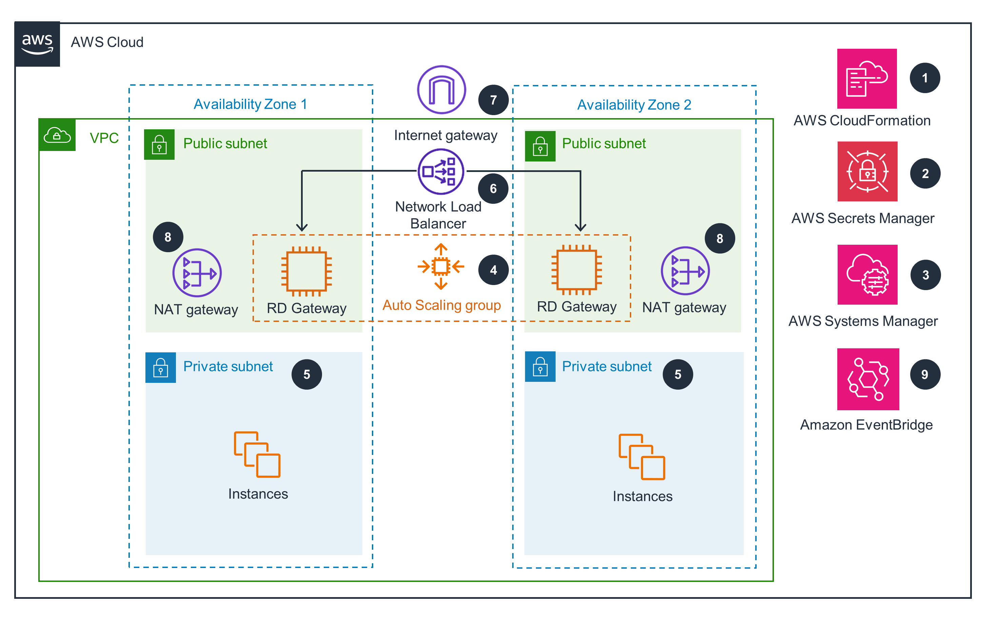

# Guidance for deploying Remote Desktop Gateway on AWS

## Table of Contents

1. [Overview](#overview)
    - [Cost](#cost)
2. [Deployment Options](#deployment-options)
3. [Deployment Steps](#deployment-steps)
4. [Cleanup](#cleanup)
5. [Additional information](#additional-info)

## Overview

This Guidance demonstrates how to deploy Remote Desktop Gateway to the AWS Cloud. RD Gateway uses the Remote Desktop Protocol (RDP) over HTTPS to establish an encrypted connection between remote users and Amazon Elastic Compute Cloud (Amazon EC2) instances running Microsoft Windows, without a virtual private network. This helps reduce attacks on your Windows-based instances while providing a remote administration solution for administrators. You can choose to deploy RD Gateway into a new virtual private cloud (VPC) in your AWS account, or into an existing VPC, either standalone or domain-joined.

*Figure 1: Remote Desktop Gateway on AWS"

As shown in Figure 1, this Guidance sets up the following:

- A highly available architecture that spans two Availability Zones.*
- A virtual private cloud (VPC) configured with public and private subnets, according to AWS best practices, to provide you with your own virtual network on AWS.*
- An internet gateway to allow access to the internet. This gateway is used by the RD Gateway instances instances to send and receive traffic.*
- Managed network address translation (NAT) gateways to allow outbound internet access for resources in the private subnets.*
- In the public subnets:
    - Up to four RD Gateway instances in an Auto Scaling group to provide secure remote access to instances in the private subnets. Each instance is assigned an Elastic IP address so it’s reachable directly from the internet.
- A Network Load Balancer to provide remote desktop protocol (RDP) access to the RD Gateway configuration instances.
- A security group for Windows-based instances that will host the RD Gateway instances role, with an ingress rule permitting TCP port 3389 from your administrator IP address. After deployment, you’ll modify the security group ingress rules to configure administrative access through TCP port 443 instead.
- An empty application tier for instances in private subnets. If more tiers are required, you can create additional private subnets with unique Classless Inter-Domain Routing (CIDR) ranges.
- AWS Secrets Manager to securely store credentials used for accessing the RD Gateway instances.
- AWS Systems Manager to automate the deployment of the RD Gateway configuration Auto Scaling group.
The template that deploys this Guidance into an existing VPC skips the components marked by asterisks above and prompts you for your existing VPC configuration.

### Cost

_You are responsible for the cost of the AWS services used while running this Guidance. As of April 2024, the cost for running this Guidance with the default settings in the default AWS Region is approximately $ 0.57 per hour._

This product deploys one or more Amazon Elastic Compute Cloud (Amazon EC2) instances running Microsoft Windows Server. The Windows Server licenses are provided by Amazon.

The following table provides a sample cost breakdown for deploying this Guidance with the default parameters in the US East (N. Virginia) Region for one month.

| AWS service  | Dimensions | Cost [USD] |
| ----------- | ------------ | ------------ |
| Amazon EC2 | 1 x t3.2xlarge instance | $ 0.48 hour |
| Elastic Load Balancing | Application Load Balancer | $ 0.03 hour |
| Amazon VPC | NAT Gateway | $ 0.05 hour |
| Amazon VPC | IPv4 Address | $ 0.01 hour |

## Deployment Options

This Guidance provides the following deployment options:

Deploy RD Gateway instances into a new VPC: This option builds a new AWS environment that consists of the VPC, subnets, NAT gateways, security groups, bastion hosts, and other infrastructure components. It then deploys RD Gateway configuration into this new VPC.
Deploy RD Gateway instances into an existing VPC: This option provisions RD Gateway configuration in your existing AWS infrastructure.
Deploy domain-joined RD Gateway instances into an existing VPC: This is similar to the option above, except that it provides domain-joined RD Gateway instances in the existing VPC and provides a few additional parameters for customizing this configuration.
This Guidance provides separate templates for these options. It also lets you configure CIDR blocks, instance types, and RD Gateway instances settings.

## Deployment Steps

1. **Sign in** to your AWS account, and launch this Guidance, as described under Deployment options. The AWS CloudFormation console opens with a prepopulated template.

2. **Choose** the correct AWS Region, and then choose *Next*.

3. On the Create stack page, **keep** the default setting for the template URL, and then choose *Next*.

4. On the Specify stack details page, **change** the stack name if needed. **Review** the parameters for the template. **Provide** values for the parameters that require input. For all other parameters, **review** the default settings and **customize** them as necessary. When you finish reviewing and customizing the parameters, **choose** *Next*.

**_NOTE:_** Unless you’re customizing the Guidance templates or are instructed otherwise in this guide’s Predeployment section, don’t change the default settings for the following parameters: QSS3BucketName, QSS3BucketRegion, and QSS3KeyPrefix. Changing the values of these parameters will modify code references that point to the Amazon Simple Storage Service (Amazon S3) bucket name and key prefix.

5. On the Configure stack options page, you can **specify** tags (key-value pairs) for resources in your stack and set advanced options. When you finish, **choose** *Next*.

6. On the Review page, **review** and **confirm** the template settings. Under Capabilities, **select** all of the check boxes to acknowledge that the template creates AWS Identity and Access Management (IAM) resources that might require the ability to automatically expand macros.

7. **Choose** *Create stack*. The stack takes about 20 minutes to deploy.

8. **Monitor** the stack’s status, and when the status is CREATE_COMPLETE, the RD Gateway deployment is ready.

9. To view the created resources, **choose** the *Outputs* tab.

## Cleanup

From the *Cloudformation Console*, select the stack and select *Delete*. This will delete all artifacts created by the deployment.

## Additional information

See the [Implementation Guide](https://aws-solutions-library-samples.github.io/engineering-design/deploying-remote-desktop-gateway-on-aws.html) for detailed additional information.
